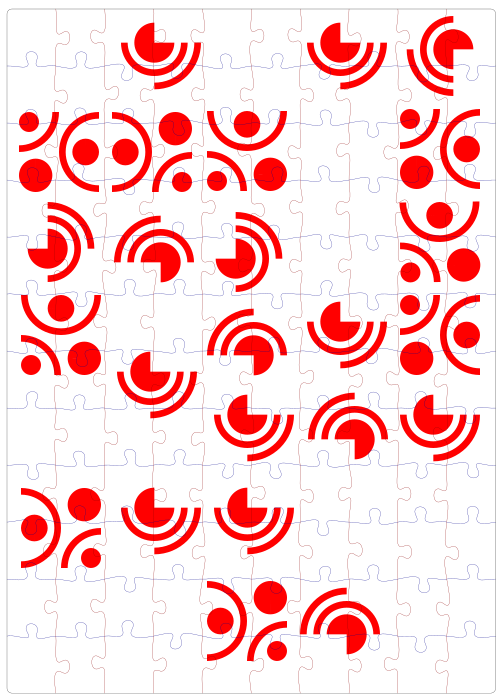

I took part in Remote Hack today, which is a monthly event where peeps get online and so some hacking together. No theme, no pressure, just whatever you want.

Last week I did a jigsaw puzzle, I'm not into jigsaw puzzles, but someone lent me a 1000 piece and I thought I would give it a go. Seems lockdown appropriate. I ended up being pretty obsessed with finishing it - I'm not sure if that's because I wanted to or because it was taking up my entire kitchen table. But suffice to say it got me thinking about _making_ jigsaw puzzles. I really like the idea of an abstract design.

So I thought I would use the hackday to try the POC (Proof Of Concept) - is this viable? Could I laser cut a generative jigsaw?

My generative SVG software was fired up. Someone asked if I could share it later, but honestly it doesn't work how I intended at the moment and is _very_ finicky. I need to go down the SVG v1 vs v2 rabbit hole a bit more. Browsers are _really_ good at rendering SVGs - my laser cutter software, not so much.

I had found a jigsaw piece generator on the Glowforge forums (Glowforge is my laser cutter) and although part of me thinks programming jigsaws is probably a very interesting activity, I am happy at this time just to grab an SVG for the cut.

Anyway, I made an SVG with the image from my software and the found generated cut path:

<figure>
  <picture>
    
</picture>
</figure>

I used corrugated cardboard as the trial. It's great that you can both cut this material and engrave it as it means you can prototype really easily and cheaply. I actually took a delivery for my neighbour a couple of days ago and when she came round to collect it, I was a bit 'can I have the box for this weird thing I want to do at the weekend?'.

Here's video of the cut [I AM SORRY IT IS 35MB]:

<video src="../media/Laser-cut-jigsaw-puzzle.mp4" controls></video>

Anyway... _doing_ the jigsaw was a pain in the arse. Card did **not** work for this 🙈. However the jigsaw bit was great. I then set about making a couple more with more substantial materials. Here's a couple of pics:

{{> pictureNew alt="A photo of the mdf jigsaw pieces" image="mdfjig" caption="MDF jigsaw pieces" }}

{{> pictureNew alt="A photo of the perspex jigsaw completed" image="perspexjig" caption="Perspex Jigsaw" }}

The first was made with MDF, this worked _really_ well. The second I made with perspex, which is amazingly tactile, it just feels lovely, but the engrave doesn't work as well as the MDF so you may as well be doing a one colour jigsaw.

Both of them suffered from quite a wobble when the jigsaw pieces were together. Where the laser cuts gives you about a gap of 0.25mm, which isn't noticeable on most things, but actually is on a jigsaw.

But having said that they work so well as a nice 'cup of tea and jigsaw activity'. Especially considering there's not much else to do at the moment ☺️

